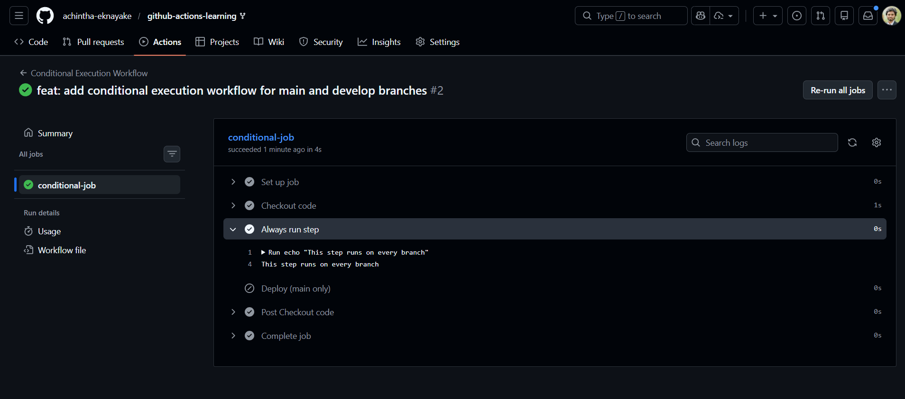
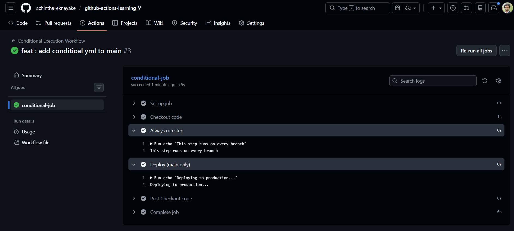
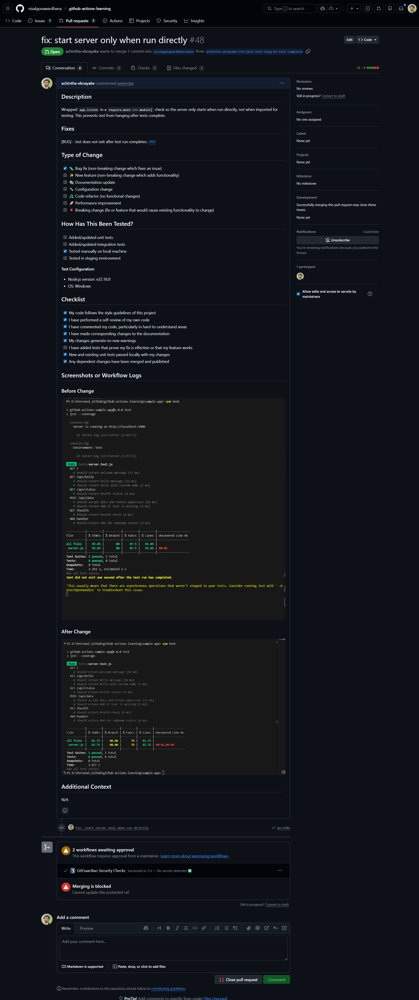
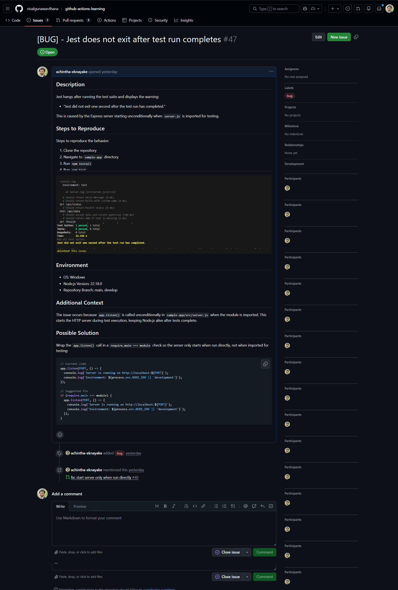

# Advanced Badge Submission - Achintha Ekanayake

**Date:** 19 January 2026
**Status:** Submitted for Review

## Tasks Completed

- [x] Task 8: Upload and Download Artifacts
- [x] Task 9: Conditional Execution
- [x] Task 10: Create a PR and Use Issue Templates

## Evidence

### Task 8: Upload and Download Artifacts

### Task 9: Conditional Execution
Screenshot showing conditional workflow on develop branch

Screenshot showing conditional workflow on main branch

### Task 10: Create a PR and Use Issue Templates
Screenshot showing PR

Screenshot showing Issue

## Notes
Any challenges faced or additional context.

---

Submitted & ready for review! ✅