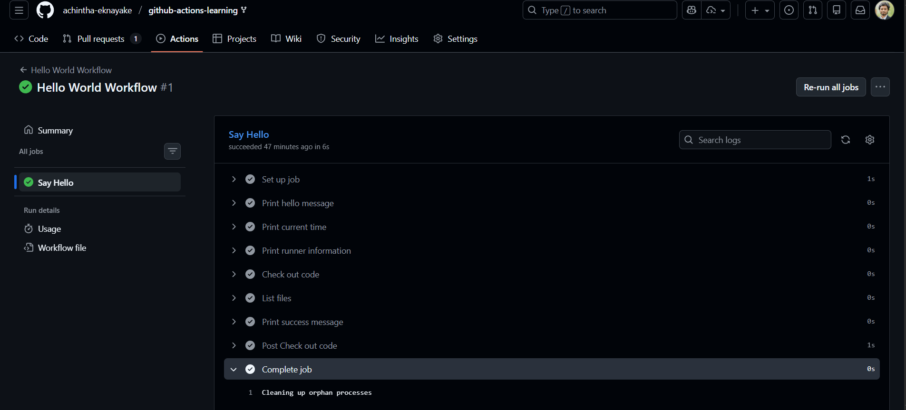
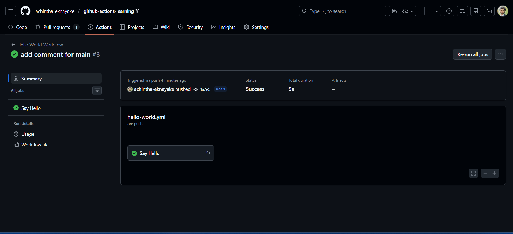
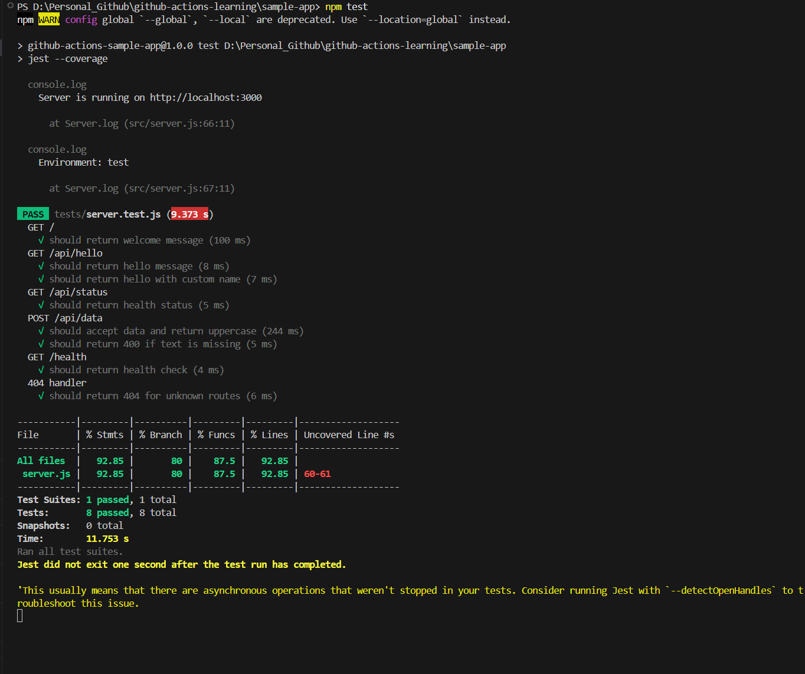

# Beginner Badge Submission - Achintha Ekanayake

**Date:** 10 January 2026
**Status:** Submitted for Review

## Tasks Completed

- [x] Task 1: Run Your First Workflow
- [x] Task 2: Understand Workflow Triggers
- [x] Task 3: Build and Test Locally

## Evidence

### Task 1: Hello World Workflow

### Task 2: Push Trigger

### Task 3: Local Tests

## Notes
Any challenges faced or additional context.

---

Submitted & ready for review! ✅