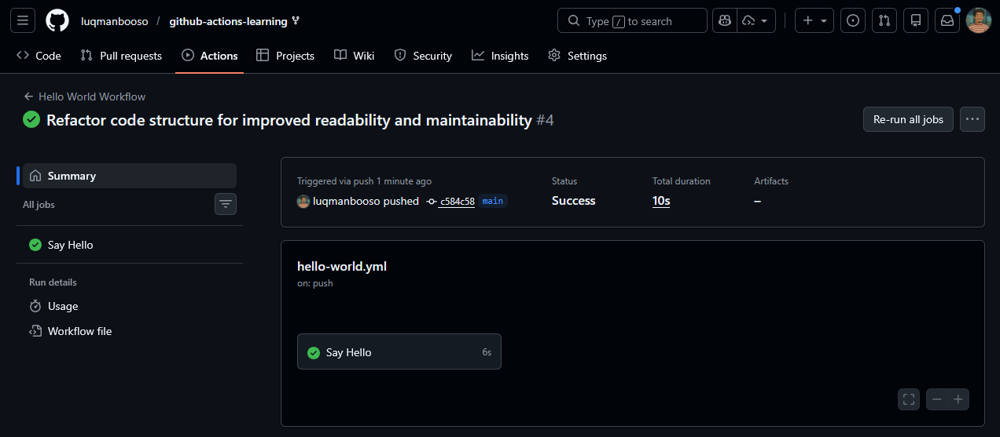
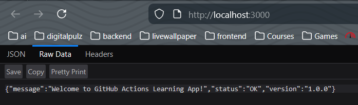
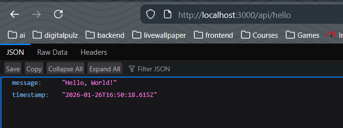
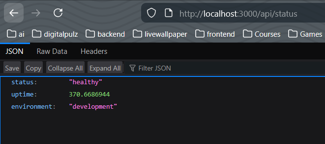
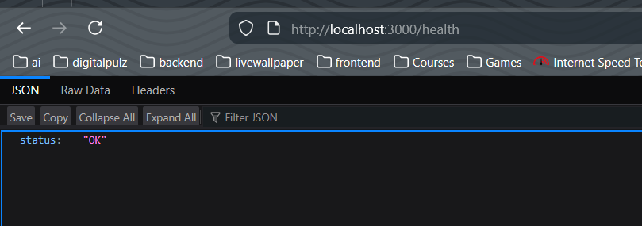

Task 1: Hello World workflow running ✅

Completion: ✅ Expand the workflow job and verify you can see all the echo outputs

Task 2: Workflow triggered by push event ✅

Completion: ✅ The workflow should run automatically when you push

Task 3: Build and Test Locally

PS C:\Users\hp\Downloads\mini\githubActiohnsLearning\github-actions-learning\sample-app> npm test

> github-actions-sample-app@1.0.0 test
> jest --coverage

 PASS  tests/server.test.js (18.61 s)                                                                                           
  GET /
    √ should return welcome message (83 ms)                                                                                     
  GET /api/hello                                                                                                                
    √ should return hello message (6 ms)                                                                                        
    √ should return hello with custom name (7 ms)                                                                               
  GET /api/status                                                                                                               
    √ should return health status (6 ms)                                                                                        
  POST /api/data                                                                                                                
    √ should accept data and return uppercase (384 ms)                                                                          
    √ should return 400 if text is missing (8 ms)                                                                               
  GET /health                                                                                                                   
    √ should return health check (6 ms)                                                                                         
  404 handler                                                                                                                   
    √ should return 404 for unknown routes (6 ms)                                                                               
                                                                                                                                
-----------|---------|----------|---------|---------|-------------------                                                        
File       | % Stmts | % Branch | % Funcs | % Lines | Uncovered Line #s                                                         
-----------|---------|----------|---------|---------|-------------------
All files  |   82.75 |    66.66 |      75 |   82.75 |                  
 server.js |   82.75 |    66.66 |      75 |   82.75 | 60-61,66-68      
-----------|---------|----------|---------|---------|-------------------
Test Suites: 1 passed, 1 total
Tests:       8 passed, 8 total
Snapshots:   0 total
Time:        21.958 s
Ran all test suites.
PS C:\Users\hp\Downloads\mini\githubActiohnsLearning\github-actions-learning\sample-app> 

Testing different API endpoints

Task 3: Local tests passing with npm test ✅