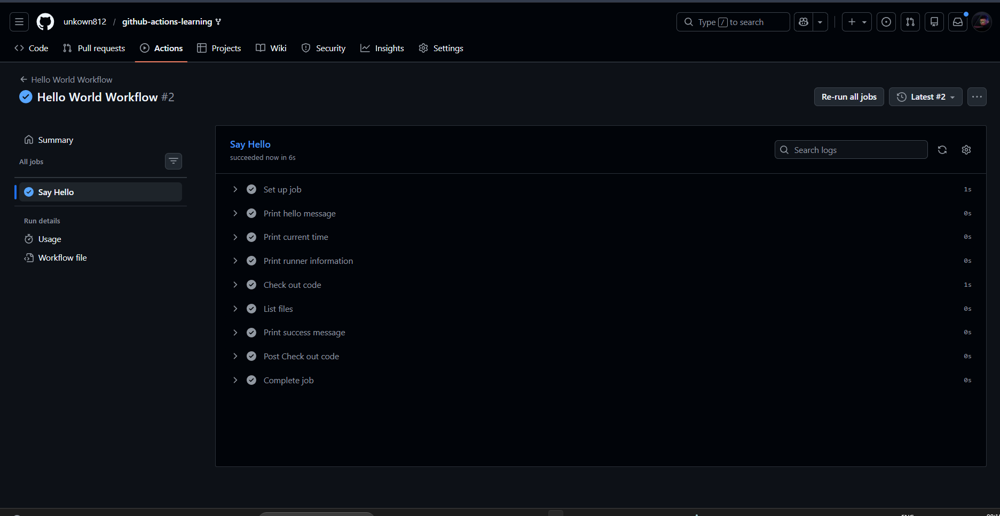
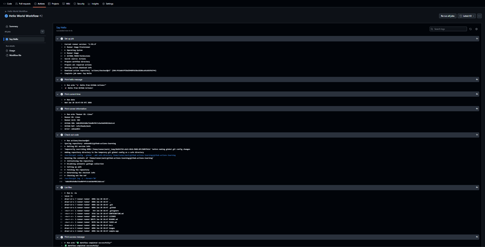
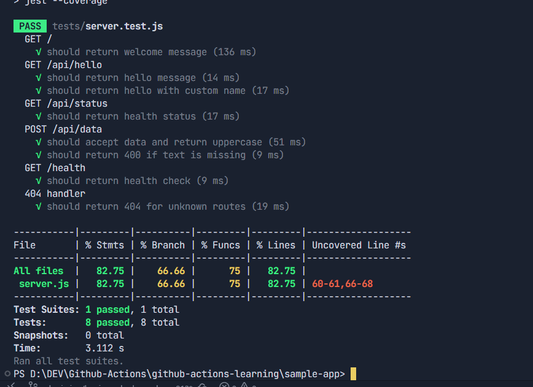

## 🎖️ Badge Submission

**Submitted by:** @unkown812 
**Badge Level:** Beginner  
**Date:** 29-01-2026 
**Status:** Pending Review

---

## 🌟 Beginner Badge Submission

### Tasks Completed
- [✅] Task 1: Run Your First Workflow
- [✅] Task 2: Understand Workflow Triggers
- [✅] Task 3: Build and Test Locally

### Evidence

#### Task 1: Hello World Workflow Execution
<!-- Attach screenshot of workflow running successfully -->
<!-- test Markup -->

#### Task 2: Push Trigger
<!-- Attach screenshot of workflow triggered by push -->

#### Task 3: Local Tests Passing
<!-- Attach screenshot of npm test output -->

**Conditions:**
- Branch-based conditions: ✅
- Event-based conditions: ✅

**Community Participation:**
- PR created with proper template: ✅
- Issue created using template: ✅

---

## ✅ Submission Checklist

- [✅] All tasks for this level completed
- [✅] Evidence (screenshots) added for each task
- [✅] Workflow files included (if applicable)
- [✅] All checklist items marked as complete
- [✅] PR title includes badge level: "🎖️ BEGINNER Badge Submission"
- [✅] Labels added: `submission`, `pending-review`, `[level]`
- [✅] Assigned to: `@nisalgunawardhana`

---

## 📝 Review Notes

<!-- This section is for reviewer use -->

**Reviewer Checklist:**
- [ ] All tasks verified as completed
- [ ] Evidence quality is sufficient
- [ ] Understanding demonstrated
- [ ] Workflow files present and working
- [ ] Labels applied correctly
- [ ] No duplicate submissions

**Feedback:**
<!-- Reviewer feedback and approval status -->

---

**Ready for review!** ✅  
**Status:** Pending Review  
**Expected Review Time:** 2-5 days

For questions or clarifications, please comment below!

See [Submission Guide](../../.github/submissions/SUBMISSION_GUIDE.md) for more details.
