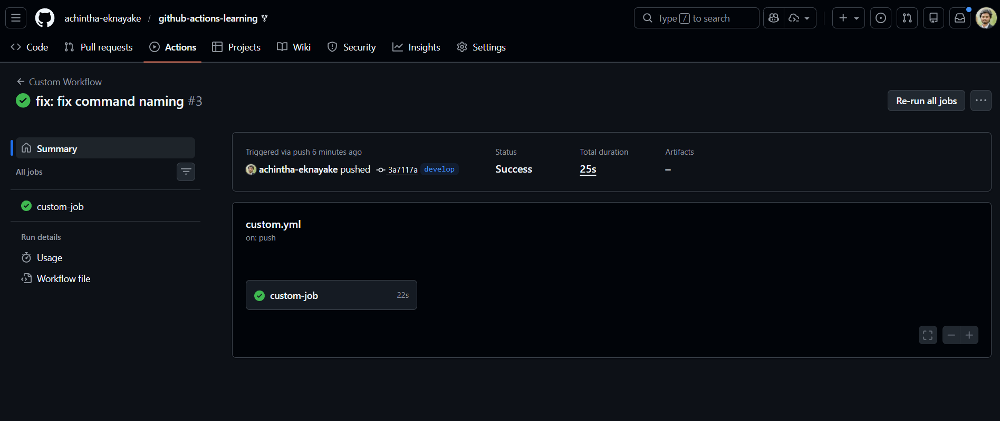
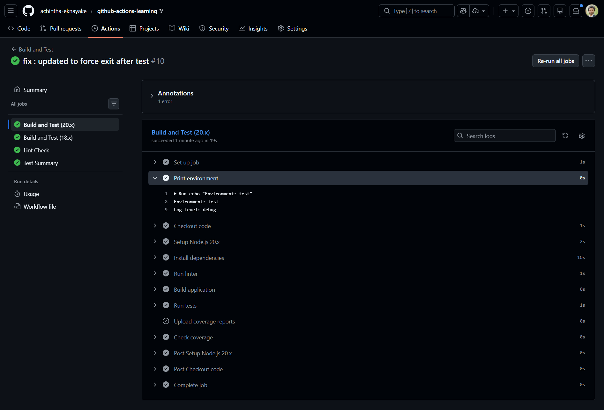
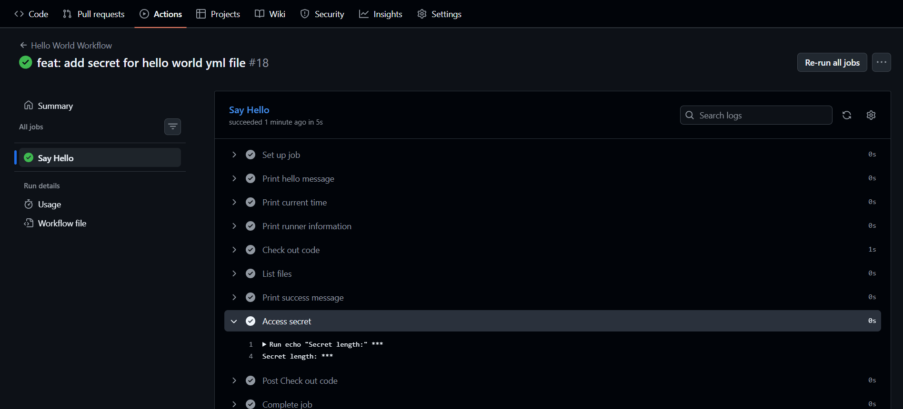
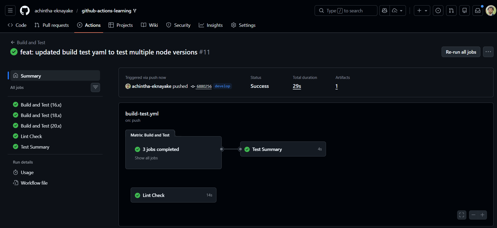

# Intermediate Badge Submission - Achintha Ekanayake

**Date:** 18 January 2026
**Status:** Submitted for Review

## Tasks Completed

- [x] Task 4: Custom workflow created
- [x] Task 5: Environment variables used
- [x] Task 6: Secrets accessed safely
- [x] Task 7: Matrix testing worked 

## Evidence

### Task 4: Custom workflow created

### Task 5: Environment variables used

### Task 6: Secrets accessed safely

### Task 7: Matrix testing worked 

## Notes
Any challenges faced or additional context.

---

Submitted & ready for review! ✅